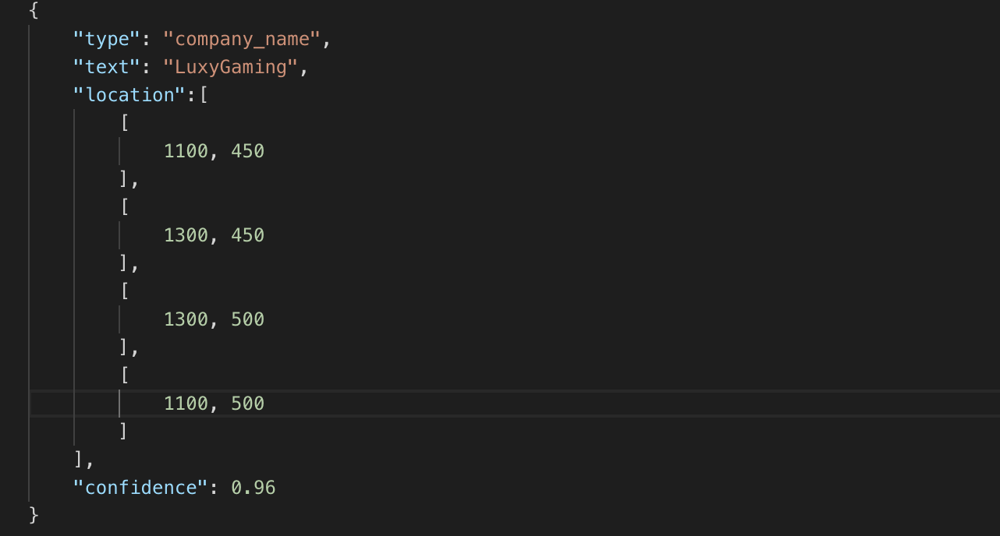
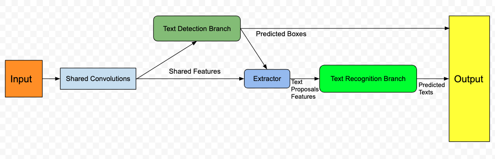
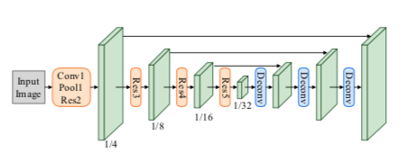
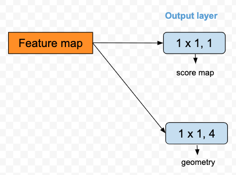
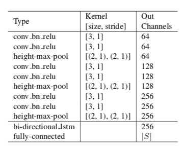

# End to end model

|Executor | Nguyen Tien Tai (bruno@cinnamon.is)  
|:-------|:-----  
|Contributor | Lucas, Linus, Victor  
|Nature | Proposal-level  
|Version history| v0.1.1

## 1. Introduction
- What is the problem ? 
	>The current pipeline contains 3 seperate stages: Text Detection, Text Recognition 
	and Information Extraction with 3 distinguished processes. We cannot utilize our previous problem results to enhance our false-positive training problem results and training process takes us a lot of time. The reasons result necessity to have a new model combined from 3 the problems.
- Input and output
	>Input: An image of invoice, contract or any business document

	
	
	>Output: Fields of interest from input image

	

## 2. Related works
- [FOTS: Fast Oriented Text Spotting with a Unified Network](https://arxiv.org/pdf/1801.01671.pdf): The structure of our end-to-end model.
- [EAST: An Efficient and Accurate Scene Text Detector](https://arxiv.org/pdf/1704.03155.pdf): EAST is a word-based and multi-oriented text detector.
- [Deep Residual Learning for Image Recognition](https://arxiv.org/pdf/1512.03385.pdf): Resnet50 is used as a backbone of our detector.
- [Connectionist Temporal Classification: Labelling Unsegmented Sequence Data with Recurrent Neural Networks](https://www.cs.toronto.edu/~graves/icml_2006.pdf): The concept for our recognitor.

## 3. Proposed method
### 3.1. Overview architecture for Layout and OCR

- In order to detect and recognize text from documents, I propose to combine [EAST](https://arxiv.org/pdf/1704.03155.pdf) and [CRNN](https://arxiv.org/pdf/1507.05717.pdf) with [CTC decoder](https://www.cs.toronto.edu/~graves/icml_2006.pdf) into a unique model. Feature maps are firstly extracted with shared convolutions. The fully convolutional network based oriented text detection branch is built on top of the feature map to predict the detection bounding boxes. The Extractor operator extracts text proposal features corresponding to the detection results from the feature map. The text proposal features are then fed into Recurrent Neural Network (RNN) encoder and Connectionist Temporal Classification (CTC) decoder for text recognition. Since all the modules in the network are differentiable, the whole system can be trained end-to-end.

	

#### 3.1.1. Shared Convolution

- Architecture of shared convolutions
	>Conv1-Res5 are operations from ResNet-50, and Deconv consists of one convolu- tion to reduce feature channels and 	one bilinear upsampling oper- ation.

	

#### 3.1.2. Extractor

- Because text recognition is very sensitive to detection noise. A small error in predicted text region could cut off several characters, which is harmful to network training, so we use ground truth text regions instead of predicted text regions during training. When testing, thresholding and NMS are applied to filter predicted text regions. After Extractor, feature maps are fed to the text recognition branch.

#### 3.1.3. Text Detection Branch

- The key component of the proposed algorithm is a neural network model, which is trained to directly predict the existence of text instances and their geometries from full images. The model is a fully-convolutional neural network adapted for text detection that outputs dense per-pixel predictions of words or text lines. This eliminates intermediate steps such as candidate proposal, text region formation and word partition. The post-processing steps only include thresholding and NMS on predicted geometric shapes. 

	

- Thresholding is then applied to each predicted region, where the geometries whose scores are over the predefined threshold is considered valid and saved for later non-maximum-suppression. Results after NMS are considered the final output of the pipeline.

#### 3.1.4. Text Recognition Branch

- The text recognition branch aims to predict text labels using the region features extracted by shared convolutions and Extractor. Our text recognition branch consists of VGG like sequential convolutions, poolings with reduction along height axis only, one bidirectional LSTM, one fully-connection and the final CTC decoder.

	

	>First, spatial features are fed into several sequential convolutions and poolings along height axis with dimension reduction to extract higher-level features. 

	>Next, the extracted higher-level feature maps $L ∈ R^{C×H×W}$ are permuted to time major form as a sequence $l_1 , ..., l_W ∈ R^{C ×H}$ and fed into RNN for encoding. Here we use a bidirectional LSTM, with $D = 256$ output channels per direction, to capture range dependencies of the input sequential features. Then, hidden states $h_1 , ..., h_W ∈ R^D$ calculated at each time step in both directions are summed up and fed into a fully-connection, which gives each state its distribution $x_t ∈ R^{|S|}$ over the character classes $S$.

## 4. Working plan
- Milestone
	>20/4/2020: Finish implementing end-to-end Layout-OCR module
## 5. Conclusion
## 6. References
All in related works